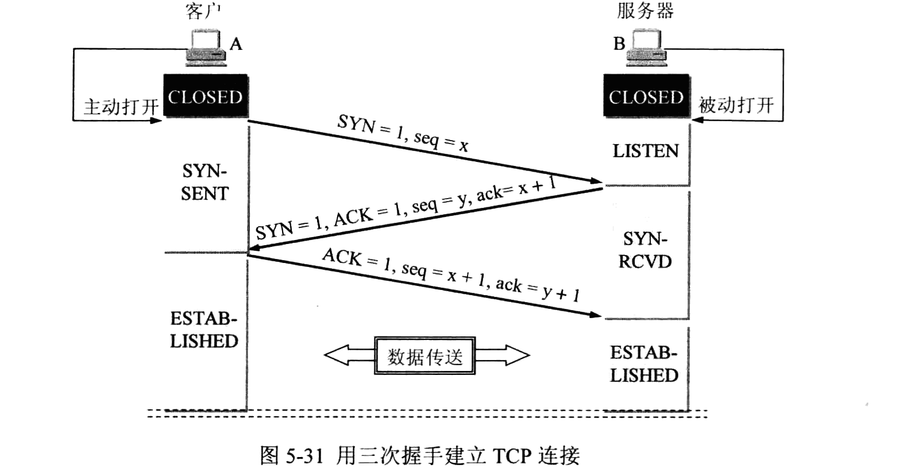

面试题整理
---------
面试题都是从牛客上做完，整理一下做错的题目：
1. 以下协议中，用来实现将IP地址映射到MAC地址的协议是（ ）。
    - A. IP
    - B. ICMP
    - C. ARP
    - D. RARP
    
**正确答案：C**
解析：RARP:MAC地址映射为IP地址， ARP:IP地址映射为MAC地址

<hr/>

2. TCP/IP 参考模型中的主机 - 网络层对应于 OSI 中的（ ）。
    - A. 网络层
    - B. 物理层
    - C. 数据链路层
    - D. 物理层与数据链路层
    
**正确答案：A**
解析：

<hr/>

3. 以下关于线性表的说法不正确的是______。
    - A. 线性表中的数据元素可以是数字、字符、记录等不同类型。
    - B. 线性表中包含的数据元素个数不是任意的。
    - C. 线性表中的每个结点都有且只有一个直接前趋和直接后继。
    - D. 存在这样的线性表：表中各结点都没有直接前趋和直接后继。

**正确答案：C**
解析：C：头结点没有直接前驱

<hr/>

4. Reply from 218.30.66.101: bytes=32 time=138ms TTL=247 这是一个 ping 的结果，其中 247 表示什么？
    - A. 目标地址距离是247跳
    - B. 最大生存时间减至了247
    - C. 247表示目标地址的端口
    - D. 发送了247个检测包
    
**正确答案：B**
解析：TTL 是 time to live 最大生存时间

<hr/>

5. 在TCP协议的三次握手中，应答方在收到发起方发送的“SYN=1，序号=1”数据报时，对其应答的描述是（ ）。
    - A. SYN=2 序号=y ACK=y+1
    - B. SYN=1 序号=2 ACK=2
    - C. SYN=1 序号=y ACK=2
    - D. SYN=2 序号=y ACK=2
    
**正确答案: C**
解析：  
其中：序号为 seq
相关链接：[TCP协议，三次握手详解](https://baijiahao.baidu.com/s?id=1618114723935605183&wfr=spider&for=pc)

<hr/>

6. 以下表达式不会出现错误的有（）
    - A. 2.toString()
    - B. 2..toString()
    - C. 2 .toString()
    - D. (2).toString()

**正确答案：BCD**
解析：首先数字后面的 " . " 会被解析成小数点而不是调用方法那个 " . "，所以 A 这样子会报错，B,C,D都避免了那个 " . " 被解析成小数点，而是被解析为调用 toString 这个方法，所以不会报错

<hr />

7. 下面哪些方式在同一个窗口下能够检测一个js对象是数组类型？（      ）
    - A. Array.isArray()
    - B. instance of
    - C. typeof
    - D. Object.prototype.toString()
    
**正确答案：ABD**
解析：
- A. Array.isArray() 决定传入的参数是否是数组类型
    ```javascript
    // 都返回 true
    Array.isArray([]);
    Array.isArray([1]);
    Array.isArray(new Array());
    Array.isArray(new Array('a', 'b', 'c', 'd'));
    Array.isArray(new Array(3));
    // Little known fact: Array.prototype itself is an array:
    Array.isArray(Array.prototype); 
    ```
- B. instance of: instanceof 运算符返回一个布尔值，表示对象是否为某个构造函数的实例
    ```javascript
    [1, 2, 3] instanceof Array // true
    ```
- C. typeof 运算符在检测 array, null, 和 object 的时候都会返回 object
    ```javascript
    typeof [1,2,3] //"object"
    typeof 2 //"number"
    typeof {} //"object"
    typeof null // "object"
    ```
- D. 可以通过 Object.prototype.toString.call(param) 来判断 param 的类型
    ```javascript
    Object.prototype.toString.call(2); //[object Number]
    Object.prototype.toString.call([1, 2, 3]); //[object Array]
    Object.prototype.toString.call({}); //[object Object]
    Object.prototype.toString.call("test"); //[object String]
    Object.prototype.toString.call(null); //[object Null]
    Object.prototype.toString.call(undefined); //[object Undefined]
    ```